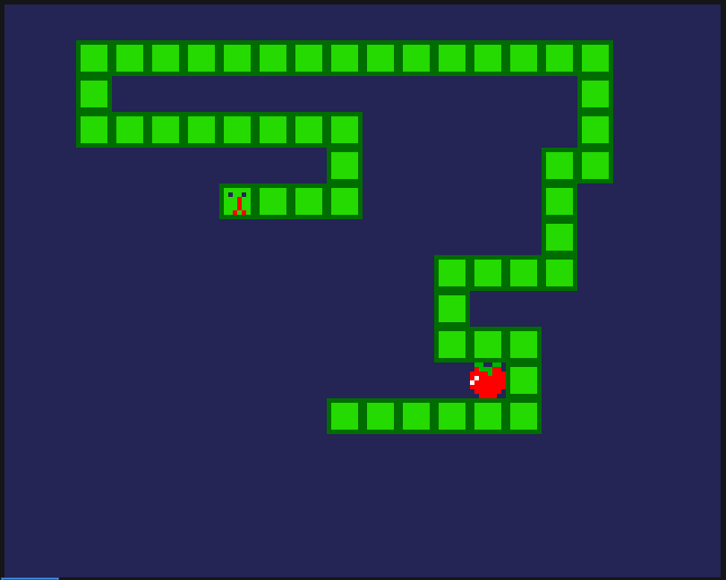
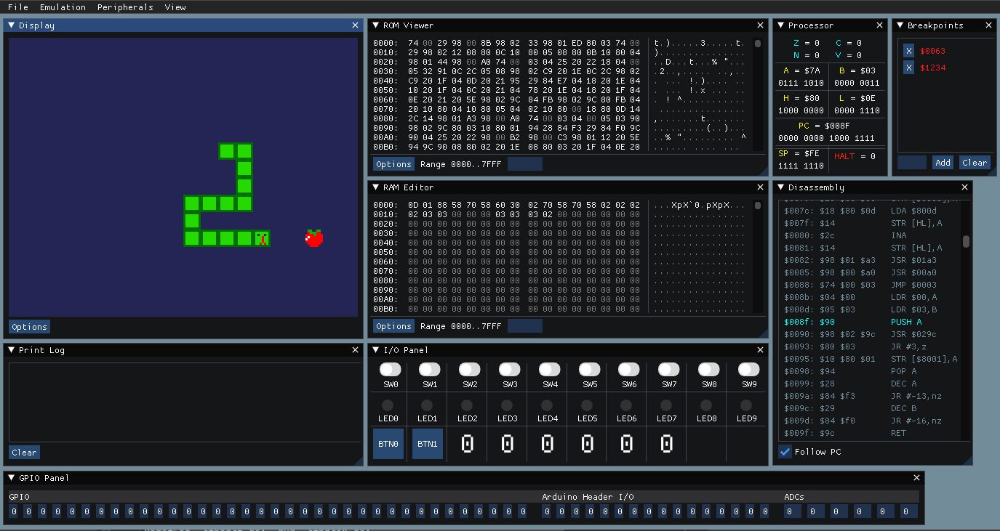

```
 __        __       __           ______  
/  |      /  \     /  |         /      \ 
$$ |      $$  \   /$$ |        /$$$$$$  |
$$ |      $$$  \ /$$$ | ______ $$ \__$$ |
$$ |      $$$$  /$$$$ |/      |$$    $$< 
$$ |      $$ $$ $$/$$ |$$$$$$/  $$$$$$  |
$$ |_____ $$ |$$$/ $$ |        $$ \__$$ |
$$       |$$ | $/  $$ |        $$    $$/ 
$$$$$$$$/ $$/      $$/          $$$$$$/                               
```

# LM-8
This project is a custom 8-bit computer architecture comprised of an Assembler, an Emulator, a
Jetbrains IDE language support plugin, a Logisim-Evolution simulation, and an FPGA implementation.






## Web Demo
[Online Demo](https://thelogicmaster.github.io/lm8/) hosted on GitHub Pages.

## Documentation
- [Architecture](ARCHITECTURE.md)
- [Assembler](ASSEMBLER.md)
- [Emulator](EMULATOR.md)
- [Hardware Interfaces](HARDWARE.md)
- [Simulation](SIMULATION.md)
- [FPGA](FPGA.md)
- [Jetbrains Plugin](PLUGIN.md)

## Attributions
- [ImGui](https://github.com/ocornut/imgui)
- [ImGuiFileDialog](https://github.com/aiekick/ImGuiFileDialog)
- [imgui_memory_editor](https://github.com/ocornut/imgui_club/tree/master/imgui_memory_editor)
- [C++ 11 string_format](https://stackoverflow.com/a/26221725)
- [Emscripten](https://emscripten.org/)
- [Dirent](https://github.com/tronkko/dirent)
- [GLEW](http://glew.sourceforge.net/)
- [SDL2](https://www.libsdl.org/)
- [CMake](https://cmake.org/)
- [Git](https://git-scm.com/)
- [Python](https://www.python.org/downloads/)
- [Perl](https://www.perl.org/)
- [Logisim-evolution](https://github.com/logisim-evolution/logisim-evolution)
- [Quartus Prime](https://www.intel.com/content/www/us/en/software/programmable/quartus-prime/overview.html)
- [arduino-songs](https://github.com/robsoncouto/arduino-songs)
- [Jetbrains IDEs](https://www.jetbrains.com/)
- [Patorjk ascii art generator](https://patorjk.com/software/taag/#p=display&f=ANSI%20Shadow&t=LM-8)