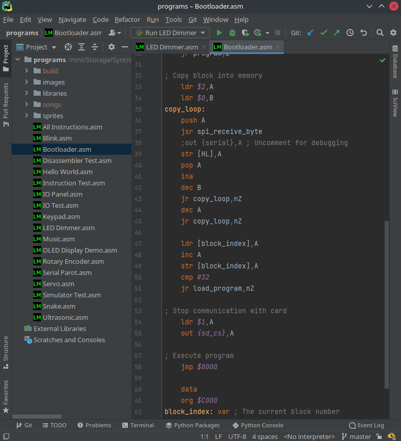

```
 __        __       __           ______  
/  |      /  \     /  |         /      \ 
$$ |      $$  \   /$$ |        /$$$$$$  |
$$ |      $$$  \ /$$$ | ______ $$ \__$$ |
$$ |      $$$$  /$$$$ |/      |$$    $$< 
$$ |      $$ $$ $$/$$ |$$$$$$/  $$$$$$  |
$$ |_____ $$ |$$$/ $$ |        $$ \__$$ |
$$       |$$ | $/  $$ |        $$    $$/ 
$$$$$$$$/ $$/      $$/          $$$$$$/                               
```

# LM-8
This project is a custom 8-bit computer architecture comprised of an Assembler, an Emulator, a
Jetbrains IDE language support plugin, a Logisim-Evolution simulation, and an FPGA implementation.





## Web Demo
[Online Demo](https://thelogicmaster.github.io/lm8/) hosted on GitHub Pages.

## Documentation
- [Architecture](ARCHITECTURE.md)
- [Assembler](ASSEMBLER.md)
- [Emulator](EMULATOR.md)
- [Hardware Interfaces](HARDWARE.md)
- [Simulation](SIMULATION.md)
- [FPGA](FPGA.md)
- [FPGA Bootloader](BOOTLOADER.md)
- [Jetbrains Plugin](PLUGIN.md)
- [Assembly Libraries](LIBRARIES.md)

## Attributions
See [Attributions](ATTRIBUTIONS.md) for the libraries and software used by the project.
